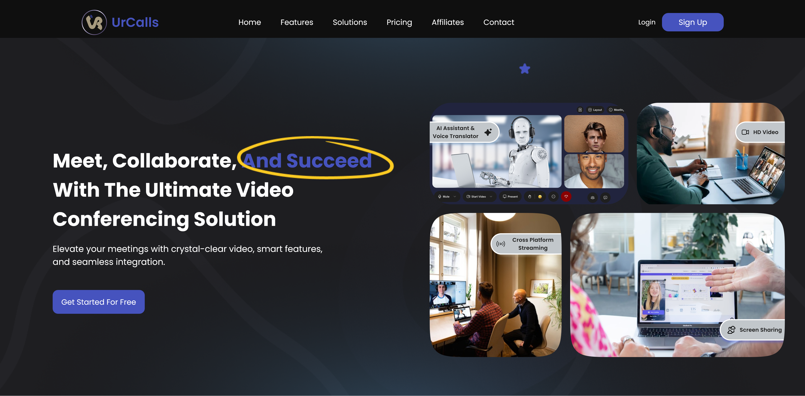
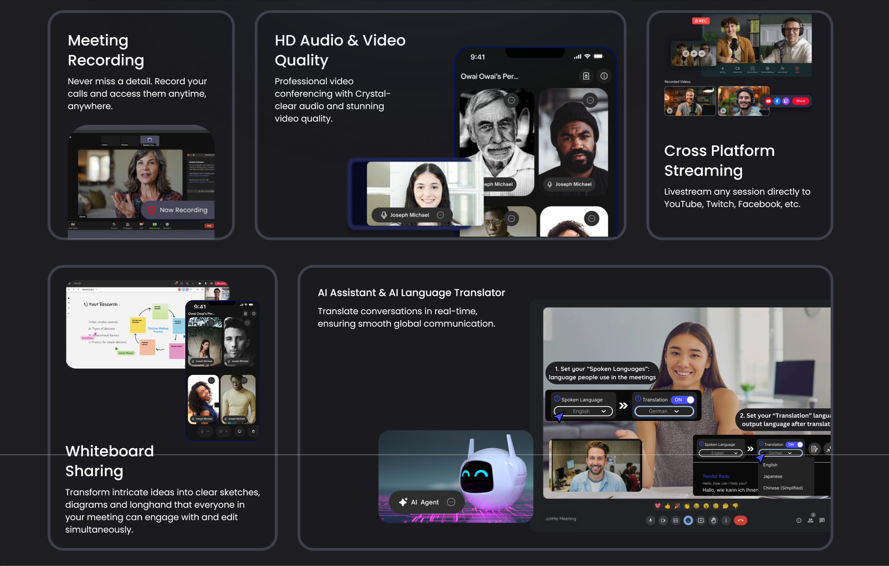
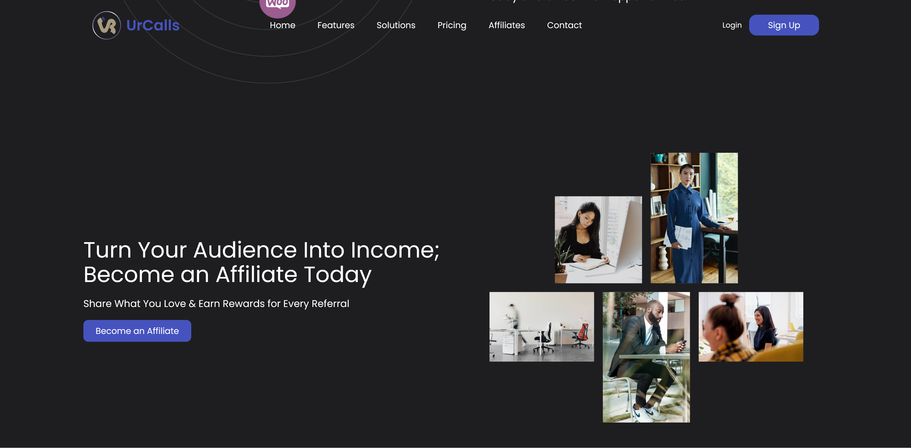

# UrCalls

## Video collaboration for SMEs, solopreneurs and independent professionals

**Role:** Product / Project Director & Delivery Lead  
**Product:** Video conferencing and virtual-engagement SaaS  
**Audience:** SMEs, solopreneurs, service providers, online educators, coaches and similar users  
**Status:** Delivered

**Product positioning:** professional video conferencing and virtual engagement without the complexity of an enterprise collaboration suite.

---

## The product problem

The collaboration market sits between two extremes.

Enterprise collaboration platforms can provide extensive capability, but often bring complexity, cost and operational overhead that smaller organisations do not need. Basic meeting tools solve the call itself, but can fall short when users need structured collaboration around the meeting.

UrCalls was built for the middle ground:

> **Not so enterprise-heavy that it becomes complicated, and not so basic that it lacks the capabilities required for serious collaborative work.**

The target was deliberately broader than conventional SME teams: solopreneurs, service providers, online educators, coaches and other independent professionals also needed a professional virtual-work environment without enterprise-style overhead.

The product therefore had to balance **capability, simplicity and accessible usage models** rather than compete on feature volume alone.

---

## Product strategy

I helped shape the product around a simple principle: give smaller organisations and independent professionals the capabilities they actually need to run professional virtual work without forcing them into an enterprise collaboration model.

That meant treating meetings, webinars, recordings, collaboration and organisation controls as connected product capabilities rather than unrelated features.

The resulting platform combined:

**Meetings · Webinars · Recording · AI meeting notes · Breakout rooms · Whiteboard · Team/seat management · Branding/customisation**

The feature surface shows the intended breadth: UrCalls was not positioned as another basic meeting utility, but as a practical collaboration platform built around the needs of smaller professional users.

---

## Product decision: build distribution into the product

The product strategy also addressed a question beyond the user experience:

**How would a new collaboration product create awareness and reach potential users at launch?**

Rather than treating acquisition as something that happened entirely outside the product, I built an affiliate referral mechanism into UrCalls as a business-growth capability.

The programme was designed for people with relevant audiences—including influencers, creators, educators, coaches and other professional users—who could promote UrCalls using personalized referral codes and earn a commission for successful referrals.

The intended flow was:

**Affiliate joins → Personalized referral code → Audience promotion → Referral attribution → Commission**

Affiliates could join through the public website, making the programme self-service rather than dependent on manual recruitment and administration.

The purpose was explicitly commercial and go-to-market oriented: **facilitate product launch, expand awareness, create a distributed acquisition channel and support user adoption.**

This was an important product-management decision because it connected the product to the business model around it. The platform was designed not only to deliver the service, but also to provide a mechanism for getting that service in front of more potential users.

No unsupported acquisition or revenue figures are claimed; the evidence here is the product capability and the business mechanism that was designed and delivered.

---

## Decision 1: distinguish collaboration from audience-scale engagement

Meetings and webinars serve different jobs.

**Meetings** support ongoing collaboration between teams, clients and participants.

**Webinars** support structured, larger-scale audience engagement such as training, events and presentations.

Rather than treating webinars as simply a larger meeting room, UrCalls gave them a distinct operational and commercial model.

This distinction allowed the product to support both everyday collaborative work and higher-scale virtual engagement without turning the entire product into an enterprise event platform.

---

## Decision 2: scale webinar usage without enterprise-style fixed pricing

Webinars introduced a different cost and capacity profile from ordinary meetings.

The product therefore used a usage-based model:

**Subscription → Webinar eligibility → Credits → Attendee tier → Session consumption**

Business and Premium users could access webinar functionality, while webinar sessions consumed credits according to the selected attendee tier.

The product decision was to let occasional users access higher-scale engagement without forcing them into a permanently high-cost enterprise plan.

This was directly connected to the original positioning: **capability should scale with the user's actual need.**

---

## Decision 3: separate recording from AI processing

Recording was designed with two distinct modes.

**Local recording** remained on the user's device and did not consume platform storage.

**Cloud recording** was managed by the platform and used organisational storage according to the applicable storage entitlement.

AI meeting notes and related AI functionality are **processed by the platform independently of the user's storage allocation**. AI processing is therefore not gated by whether the user has available recording storage.

The important product boundary was therefore:

**Recording → Storage entitlement**  
**Meeting content → AI processing**

AI processing is a platform capability in its own right, not a feature that consumes or depends on the customer's recording-storage allowance.

---

## Decision 4: keep AI as a productivity layer

AI was deliberately positioned as an enhancement to collaboration, not as the identity of the product.

AI-generated meeting notes, summaries and related meeting intelligence reduce the administrative work that follows a meeting while leaving the core collaboration experience unchanged.

The AI capability is handled as a platform service. Its processing path is separate from recording storage and user storage entitlements.

The product remained a video collaboration platform first, with AI improving what happens after or around collaborative sessions.

---

## Decision 5: make organisation controls part of the product

UrCalls was designed as a multi-user business platform rather than a collection of individual meeting accounts.

Organisation and seat management provided a structure for teams, permissions and plan entitlements. Branding and customisation could also be controlled at the organisation level so customer-facing experiences remained consistent across hosts.

This mattered particularly for service providers, educators, coaches and businesses using virtual meetings as part of their professional delivery.

---

## Technical product challenge

The product promise created a technical requirement: the experience needed to remain usable for customers operating under varying network conditions while supporting real-time communication at scale.

I worked with engineering around WebRTC performance, network reliability, latency, scalability and infrastructure cost.

The product therefore required trade-offs between:

**Experience quality ↔ Network resilience ↔ Scale ↔ Infrastructure cost**

This was technical product work because the customer promise—professional collaboration without enterprise overhead—depended on the underlying system behaving reliably in real-world conditions.

---

## My role

I operated across product definition and technical delivery, translating business requirements into structured product and engineering work and coordinating execution across frontend, backend, infrastructure, design, marketing and operations.

My responsibilities included:

- shaping product scope and delivery priorities
- translating business requirements into implementable workflows
- coordinating frontend, backend and infrastructure dependencies
- working through real-time communication and reliability constraints with engineering
- designing the affiliate referral mechanism as part of the launch and adoption strategy
- aligning product readiness with launch and marketing activity
- overseeing post-launch stabilisation and iteration
- validating that delivered capabilities matched the intended product behaviour

The contribution was not simply coordinating a list of features. It was helping turn the product positioning into a coherent set of capabilities, commercial rules, technical constraints and a practical path to market.

---

## Evidence

The repository contains deeper product documentation, implementation context and interface evidence.

Selected screens demonstrate the main operating surfaces:

**Core meeting experience** — the primary collaborative workspace.

**Meeting entry** — pre-join configuration before participants enter a session.

**Workspace** — the surrounding platform for meetings, webinars, recordings and account activity.

**Growth mechanism** — self-service affiliate onboarding and referral-led acquisition capability.

---

## Outcome

UrCalls was delivered as a video conferencing and virtual-engagement platform designed to occupy the gap between enterprise-heavy collaboration systems and basic meeting tools.

The product combined professional meeting capability with webinars, recording, AI-assisted documentation, collaboration features, organisation controls and customisation. It also incorporated a deliberate business-growth mechanism so the product had a built-in route for affiliate-led awareness and acquisition.

Specific commercial or adoption metrics are not claimed here.

The product outcome that can be demonstrated is the translation of a clear market position into a working SaaS platform with differentiated product, commercial, technical and go-to-market decisions.

---

## Repository

The [README](README.md) provides the deeper product and delivery documentation, while this case study presents the high-level product story and key decisions.

[View the UrCalls live product](https://urcalls.com)
